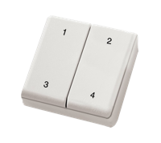

You need an EnOcean USB dongle:

Get one from [Farnell](http://uk.farnell.com/enocean/usb-300/usb-gateway-for-radio-868mhz/dp/2342011).

You need an EnOcean push button:

Get one from [Farnell](http://uk.farnell.com/enocean/ptm-210/module-switch-radio-tx-868mhz/dp/2134137) or [Houm.io](http://houm.io) :)

    npm install
    ENOCEAN_DEV=/dev/cu.usbserial-FTXMJJM6 nodemon index.coffee
    [Click click]
    { enoceanAddress: '008baffe', event: 'keydown', key: '1' }
    { enoceanAddress: '008baffe', event: 'keyup', key: undefined }
    { enoceanAddress: '008baffe', event: 'keydown', key: '2' }
    { enoceanAddress: '008baffe', event: 'keyup', key: undefined }
    { enoceanAddress: '008baffe', event: 'keydown', key: '3' }
    { enoceanAddress: '008baffe', event: 'keyup', key: undefined }
    { enoceanAddress: '008baffe', event: 'keydown', key: '4' }
    { enoceanAddress: '008baffe', event: 'keyup', key: undefined }
    { enoceanAddress: '008baffe', event: 'keydown', key: '12' }
    { enoceanAddress: '008baffe', event: 'keyup', key: undefined }
    { enoceanAddress: '008baffe', event: 'keydown', key: '34' }
    { enoceanAddress: '008baffe', event: 'keyup', key: undefined }
